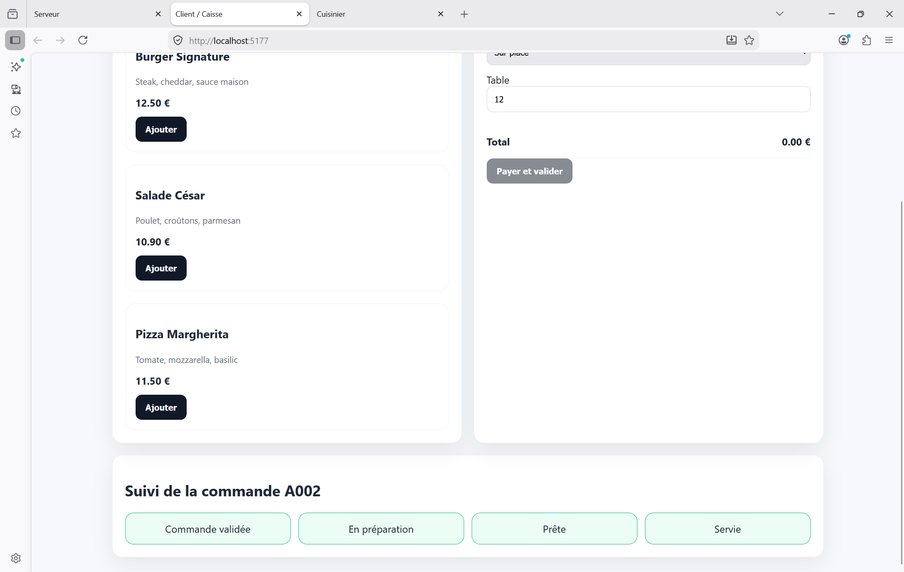
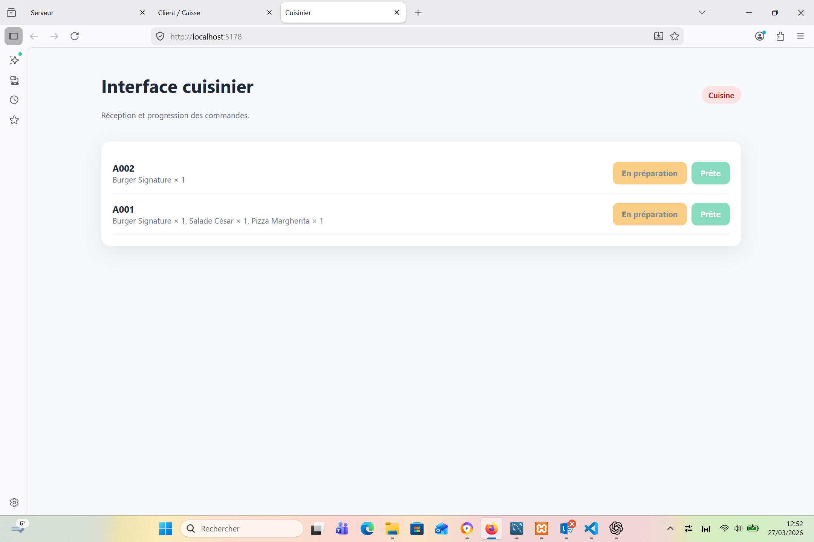
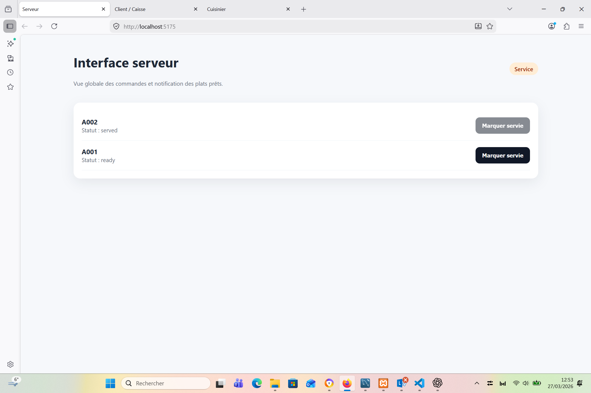

# 🍽️ Restaurant Order System

## 📌 Description

Application web permettant la gestion des commandes d’un restaurant en temps réel.

## 🚀 Fonctionnalités

* Gestion des commandes
* Interface client et admin
* Mise à jour en temps réel (Socket.io)
* Authentification utilisateur

## 🛠️ Stack technique

* Front-end : React
* Back-end : Node.js / Express
* Temps réel : Socket.io
* Base de données : MongoDB / MySQL

## 📸 Screenshots

(Ajoute des images ici)

## ⚙️ Installation

```bash
git clone https://github.com/ggildasafouba-spec/restaurant-order-system
npm install
npm start
```

## 🎯 Objectif

Créer une application complète simulant un système réel de gestion de restaurant.

## 🚀 Améliorations futures

* Paiement en ligne
* Notifications
* Dashboard avancé

 ## 📸 Screenshots







